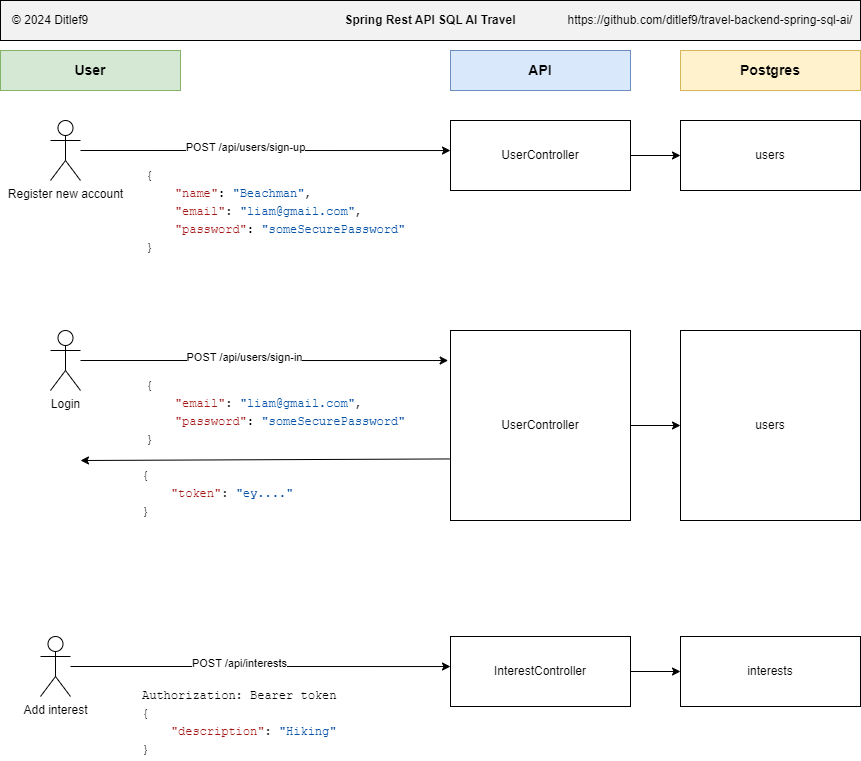

# 🗺️ Smart Travel Planner API 🌍

The **Smart Travel Planner API** is a Java Spring Boot application designed to help users plan
trips by suggesting itineraries, attractions, and accommodations based on their travel interests.
This API includes user authentication and uses PostgreSQL for data persistence.





---

## ✨ Features

- 🔐 User Registration & Authentication: Secure user signup and login.
- 🏖️ Personalized Travel Recommendations: Custom travel plans based on user preferences.
- 🐘 PostgreSQL Database: Stores user data and travel interests.
- 🔒 Secure Endpoints: Protected with Spring Security for authenticated access.
- ☕ Java (Spring Boot): Backend framework for application logic.
- 🔐 Spring Security: Manages authentication and access control.
- ⚙️ Gradle: Dependency and build management.
- 📜 Springdoc OpenAPI: Auto-generated API documentation.
- 🌐 OpenAI API: AI-powered travel recommendations.
---

## OpenAI API Key


To run create a .env file in your root with the following:

```
OPENAI_API_KEY=sk-blablabla-1234567890
```

---

## 🚀 Installation on Windows

### 1. Install Java 23 or newer
Set `JAVA_HOME`:<br>
System > Advanced system settings > Environment variables >
System variables: [New]<br>
* Variable Name: `JAVA_HOME`
* Variable Value: `C:\Program Files\Java\jdk-23`<br><br>

Set `Java path`:<br>
Path > [Edit] > Then add the following on new line:<br>
`%JAVA_HOME%\bin`
<br><br>

### 2. Setup PostgreSQL

Install PostgreSQL. Username and password is located at `application.properties`.


### 3. Add a user and interest

Start `SpringRestApiSqlAiTravelApplication`. Then you can either run `UserDetailsInserter` which setups
some data, or add user and interest manually:<br><br>

*Add new user:*<br>
POST http://localhost:8080/users<br>

Body:<br>
```
{
    "name": "Liam Beachman",
    "email": "liam@gmail.com",
    "birthDate": "2020-10-28",
    "password": "someSecurePassword"
}
```

Now you can view the users and their interests:

```sql
SELECT user_details.id, user_details.name, interest.description FROM user_details JOIN interest ON user_details.id=interest.user_id
ORDER BY user_details.id ASC
```

This will give you username and their interests:

| User ID | Name             | Interest                 |
|---------|------------------|--------------------------|
| 1       | Liam Beachman    | Beach relaxation         |
| 1       | Liam Beachman    | Swimming in the ocean    |
| 1       | Liam Beachman    | Snorkeling adventures    |
| 1       | Liam Beachman    | Cruise vacations         |
| 2       | Emma Safari      | Wildlife safari          |
| 2       | Emma Safari      | Bird watching            |
| 2       | Emma Safari      | Camping in nature        |
| 2       | Emma Safari      | Historical sites         |
| 3       | Noah Roadtripper | Road trips               |
| 3       | Noah Roadtripper | Island hopping           |
| 3       | Noah Roadtripper | Camping under the stars  |
| 3       | Noah Roadtripper | Food and wine tours      |
| 4       | Olivia Explorer  | Cultural festivals       |
| 4       | Olivia Explorer  | Scuba diving             |
| 4       | Olivia Explorer  | Exploring national parks |

Now we want to use AI to recommend travel destinations for a user.

---

## 📖 API Endpoints - (Spring doc-openapi)


Documentation URL: http://localhost:8080/swagger-ui/index.html

(The artifact ID was fetched from https://github.com/springdoc/springdoc-openapi/blob/main/springdoc-openapi-starter-webmvc-ui/pom.xml (artifactId).)


User Registration: /api/users/register
User Login: /api/users/login
Change Password: /api/users/change-password
Delete User: /api/users/{userId}


## 📜 License

This project is licensed under the
[Apache License 2.0](https://www.apache.org/licenses/LICENSE-2.0).

```
Copyright 2024 github.com/ditlef9

Licensed under the Apache License, Version 2.0 (the "License");
you may not use this file except in compliance with the License.
You may obtain a copy of the License at

    http://www.apache.org/licenses/LICENSE-2.0

Unless required by applicable law or agreed to in writing, software
distributed under the License is distributed on an "AS IS" BASIS,
WITHOUT WARRANTIES OR CONDITIONS OF ANY KIND, either express or implied.
See the License for the specific language governing permissions and
limitations under the License.
```